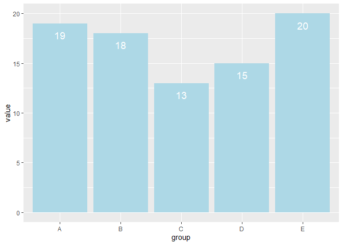
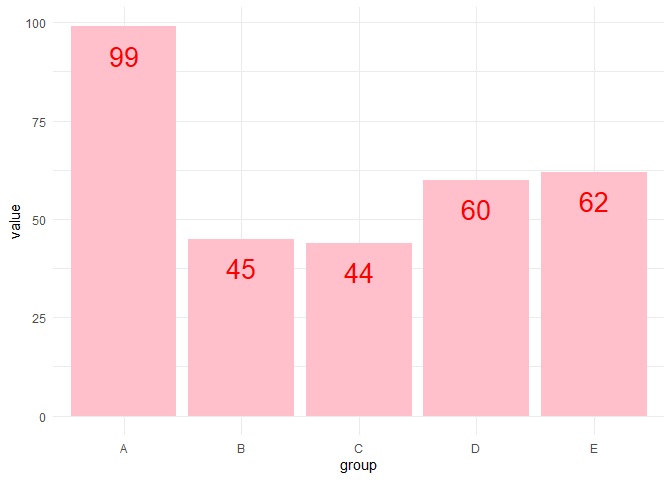

---

editor_options: 
  markdown: 
    wrap: 72
---

# Writing functions and helpers

Reference for writing functions was [this chapter](https://r4ds.hadley.nz/functions.html) from *R for Data Science*.

## 1. Leaving the house

Leaving the house daily means interacting with ‘that’ which is around. The following is the scripted order in which these items (things) are weighed when leaving the house to work/school (Place). These things are given a value of the importance and daily use they demand. This script can be replicated with any assortment of things and can be an example fo a workflow. The idea case study is the replacement f things and the use of workflow steps in which project steps can be conducted based off importance.

What the following is doing is showing the importance of a function, how a function takes inputs from a set of instructions, and the return/output.

Function,

- A reusable block that is designed to preform a specific task

Argument

- An input given to a function

Return Values

- The resulting product of the function

Each morning “leaving the house” is my workflow this example case is used to structure this document as a way of represnting the skills for when the same type of workflow is needed when analysis exterior factors. Each morning i have a workflow,

1.  Wake up,

2.  check what is needed

3.  Grab what is needed

4.  Check todays conditions

5.  Grab situation specific items

6.  leave

**Things you *always* need: always_need**

- **Phone** (Necessity for bus pass, maps, contact)

- **Backpack** (Carries books, notebooks, and computer)

- **Keys** (Keys to office, lab, and home)

- **Wallet** (Payment methods)

**Things you *sometimes* need**: **sometimes_need**

- **Hat** (If i didn’t feel like brushing my hair)

- **Energy** **Drink** (I like caffeine but not coffee)

- **Raincoat** (If rain is coming a raincoat is more practical then a umbrella)

- **Other** (This stands for all other situation items)

Here is a block of pseudocode, filled in the fake code that would be used in such a workflow.

```         
function leaving_the_house {
    always_need Phone, Backpack, Keys, Wallet
    if rain then bring "Raincoat"
    otherwise do nothing
    
}
```

From your pseudocode, decide on your arguments and write out a working R function. It should return a list or string giving the things you’ll need based on the arguments you give. If you want to get fancy, use some calls to `print` or `cat` to make a nice printout as well.

``` r
leaving_the_house <- function(rain) {
  always_need <- c ("Phone", "Backpack", "Keys", "Wallet")
if(rain) {always_need <- c (always_need, "raincoat")}
print(always_need)
}
```

Had to look up

`<- assign`

`c() combine`

Then call your function a few times with different arguments. Start with ones that match what you did today, then try it with what you’ll need to do tomorrow.

``` r
today <- leaving_the_house(rain = TRUE)
```

```         
[1] "Phone"    "Backpack" "Keys"     "Wallet"   "raincoat"
```

``` r
today <- leaving_the_house(rain = FALSE)
```

```         
[1] "Phone"    "Backpack" "Keys"     "Wallet"  
```

``` r
tomorrow <- leaving_the_house(rain = FALSE)
```

```         
[1] "Phone"    "Backpack" "Keys"     "Wallet"  
```

``` r
tomorrow <- leaving_the_house(rain = TRUE)
```

```         
[1] "Phone"    "Backpack" "Keys"     "Wallet"   "raincoat"
```

## 2. Chart labels

### Labels across one range

You’re making a bar chart, and you want to place labels near the end of each bar. The labels should be inside the bar, but you want a little bit of space between the top of the text and the end of the bar, like so:


Figure out the arithmetic you’ll need to do to place labels in this way. You want to choose a certain amount that you’ll nudge the text down from the end of each bar. I’d recommend drawing this out by hand on paper, first for just one bar, then for all 5. Again, start with pseudocode if that might help, or jump right into an R function. Use the data in the next chunk; it’s not exactly the same as what’s in the example chart, but it’s generated similarly.

``` r
library(dplyr)
```

```         
Attaching package: 'dplyr'

The following objects are masked from 'package:stats':

    filter, lag

The following objects are masked from 'package:base':

    intersect, setdiff, setequal, union
```

``` r
library(ggplot2)

data1 <- structure(
    list(group = c("A", "B", "C", "D", "E"), value = c(19, 18, 13, 15, 20)),
    row.names = c(NA, -5L),
    class = c("tbl_df", "tbl", "data.frame")
)

data1
```

```         
# A tibble: 5 × 2
  group value
  <chr> <dbl>
1 A        19
2 B        18
3 C        13
4 D        15
5 E        20
```

The first version of your function will take a vector `y`, for the y value of each observation. It should return a vector of the same length, with the position at which you want to place each text label. So if you decide that values 2, 3, and 5 should have labels placed at 1.5, 2.5, and 4.5, then calling

``` r
label_nudge(c(2, 3, 5))
```

should return `c(1.5, 2.5, 4.5)`. You’ll probably find this looks best if you nudge every value down by a fixed amount; your task is to figure out what that amount is.

``` r
label_nudge <- function(y) {
    # do your calculations here
    # when you're ready, replace 0 with your return value
    offset <- .02* max(y)

    return(y - offset)
}

label_nudge(data1$value)
```

```         
[1] 18.6 17.6 12.6 14.6 19.6
```

Now you should be able to call that function, assign the nudged values to a variable in your data frame, and use those nudged values to place labels. Keep adjusting the function until the label placement looks how you want. If you haven’t used `ggplot` much yet, don’t worry; the code I’ve set up should run for you.

theme_minimal()

``` r
data1$y_nudge <- label_nudge(data1$value)
ggplot(data1, aes(x = group, y = value)) +
    geom_col(fill = "lightblue") +
    geom_text(
        aes(label = value, y = y_nudge),
        color = "white",
        size = 5,
        vjust = 1.5
    )
```



``` r
# vjust is the vertical justification; vjust = 1 means labels will be aligned at the top
```

### Scaling your function

Part of the purpose of writing a function is that it can scale to other situations. If you hardcoded a certain amount to nudge your labels by for the first range, it might not work as well for a different range. Try repeating what you just did (calling the function to set label positions) with a different dataset, and see if you still like the placement. If not, you’ll need some different calculations to fit different ranges of numbers.

``` r
data2 <- structure(
    list(group = c("A", "B", "C", "D", "E"), value = c(99, 45, 44, 60, 62)),
    row.names = c(NA, -5L),
    class = c("tbl_df", "tbl", "data.frame")
)

data2
```

```         
# A tibble: 5 × 2
  group value
  <chr> <dbl>
1 A        99
2 B        45
3 C        44
4 D        60
5 E        62
```

``` r
data2$y_nudge <- label_nudge(data2$value)

ggplot(data2, aes(x = group, y = value)) +
    geom_col(fill = "pink") +
    geom_text(
        aes(label = value, y = y_nudge),
        color = "red",
        size = 7,
        vjust = 1.5
    )  + theme_minimal()
```



## 3. Number formatting

Develop a few functions for formatting different types of numbers—we’ll start with percentages, currency, and large numbers (over 1,000).

### Simple functions

First, we’ll just use base R functions, `round`, `formatC`, and `paste0` (like `paste`, but with a default of no separator). Here are the numbers you’ll be formatting as integers, with the desired output:

``` r
percent_vals <- c(0.05, 0.1, 0.512, 0.678) # want 5%, 10%, 51%, 68%
dollar_vals <- c(100, 110.70, 823, 1123) # want $100; $111; $823; $1,123
comma_vals <- c(2345, 10123.4, 999, 1205) # want 2,345; 10,123; 999; 1,205
```

``` r
# define functions here
percent1 <- function(x) {
  paste0(round(x * 100), "%")
}
percent1(percent_vals)
```

```         
[1] "5%"  "10%" "51%" "68%"
```

``` r
dollar1 <- function(x) {
  paste0("$", formatC(round(x), format = "d", big.mark = ","))
}
dollar1(dollar_vals)
```

```         
[1] "$100"   "$111"   "$823"   "$1,123"
```

``` r
comma1 <- function(x) {
  formatC(round(x), format = "d", big.mark = ",")
  }
comma1(comma_vals)
```

```         
[1] "2,345"  "10,123" "999"    "1,205" 
```

[Paste0 lookup](https://r-statistics.co/base-paste-in-R.html)

[formatC lookup](https://www.rdocumentation.org/packages/base/versions/3.6.2/topics/formatC)

Round was self explanatory, i am rounding the value to the nearest value of whatever value i input. (x = .0532)\* 100. x = 53 “%”.

### Generating functions

The package `scales` has helper functions you can use; these drive many of the calculations under the hood in ggplot. Read through the package docs to get familiar, especially with the `label_*` functions (functions with names starting with “label\_”).

First, call one of the `scales` functions and assign the result to a variable. Then see what type of object it is:

``` r
number <- scales::label_number()
class(number)
```

```         
[1] "function"
```

The `scales::label_*` functions are actually *function factories*, functions that return functions. This might seem weird, but they help you develop custom number formatting functions that are both specific and reusable. You can read details about function factories in [Advanced R](https://adv-r.hadley.nz/function-factories.html).

Define another set of functions, now using `scales::label_percent`, `scales::label_currency`, and `scales::label_comma`. For example, if you want to label numbers with 2 numbers after the decimal point, you can use `scales::label_number` to create a labeller function:

``` r
decimal <- scales::label_number(accuracy = 0.01)
decimal(c(1.234, 5.1, 10.999))
```

```         
[1] "1.23"  "5.10"  "11.00"
```

## 4. Finishing up

If you came up with any functions you think will be useful moving forward, copy them over to `utils/helper_functions.R` so you can use them in any of your labs and projects.
