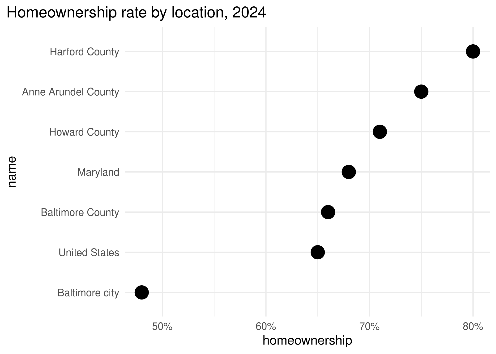
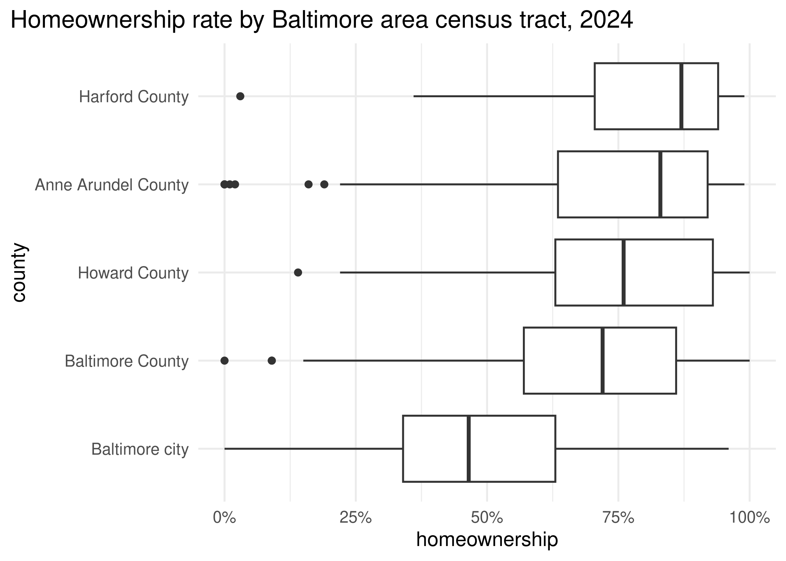
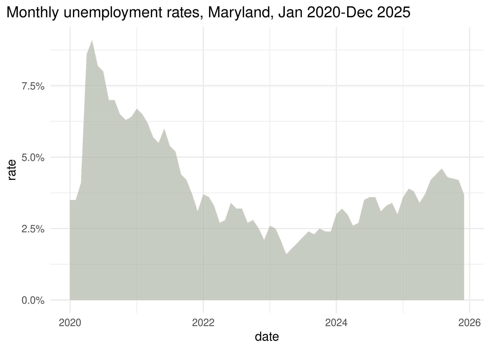
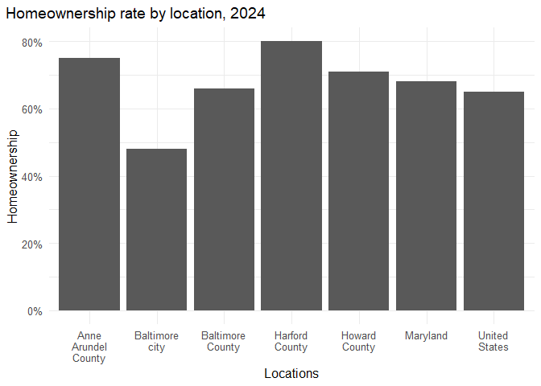
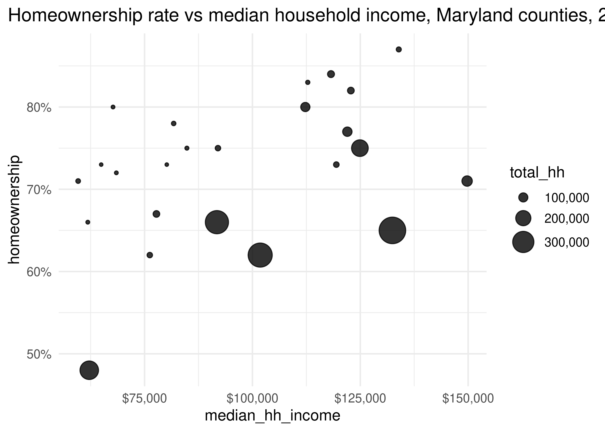
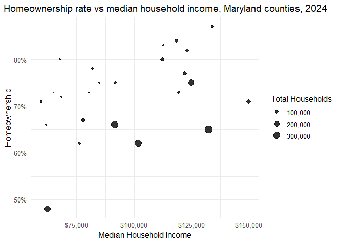
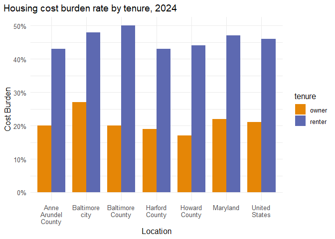

# Visual encodings, Keaton C Green


For this assessment i am property mapping data into visual encoding, The
core exercise is the analysis and notes on the first set of encoded
charts. Then shifting into the production and editing of encoding charts
of a high quality.

References of this assessment are:

- Wilke’s book, chapters
  [2](https://clauswilke.com/dataviz/aesthetic-mapping.html) and
  [17](https://clauswilke.com/dataviz/proportional-ink.html)
- Munzner’s chart of visual encoding rankings [on the course notes
  site](https://umbc-viz.github.io/ges778/extras/encodings.html)
- The [ggplot2 documentation](https://ggplot2.tidyverse.org)

## Identifying Encodings

For each of the following charts we examine,

- Type of chart
- All major encodings (x- and y-axes, size, color, shape, etc.)
- What encoding your brain *primarily* reads to understand the data
  (lightness, position, length, etc.)
- What pattern is highlighted by this type of chart (distribution,
  absolute amounts, relative amounts, etc.)
- Any markings that guide you in reading the chart
- Anything that is not essential to understanding the chart (i.e. “chart
  junk”)

### Chart 1


> - This is a *Bar Chart*, that is vertical.
> - All major encodings are a *X-Axis* being geographic areas structured
>   in such a way to have a comparison between the United States,
>   Maryland, and the counties within. The Y-axis represents the
>   home-ownership percentages. This means the bar length is encodes the
>   percentage of households listed as homeowners.
> - The encoding my brain primarily reads is the bar lengths then goes
>   to the names. Only then when i see the variation do i look at the
>   percentage to see the variation in the rates. This is ok but could
>   be much better if there were clearer separation; of geographic size,
>   gaps between the entire geography size, and maybe more color
>   variation.
> - The pattern highlighted is the home-ownership rates between
>   geographies.
> - The percentage labels help estimate and compare the rates of the
>   geographies.
> - I wouldn’t assign anything on this chart as chart junk as it is very
>   simple.

### Chart 2


> - This chart is a bar chart, that is horizontal.
>
> - All major encodings are the Y-axis shows the geographic areas and
>   the x-axis represents the percentages. There is no cleaver use of
>   color or other encodings within this chart.
>
> - The primary encoding my brain focuses on is the bar length and the
>   horizontal positions, its also notable that the listed geographies
>   are labeled largest to smallest.
>
> - The pattern the chart is focused on showing is the variation in
>   homeowner rates over geography with the focus being the percentages.
>
> - The axis labels, percentage markings, and guidelines guide the
>   comparison.
>
> - There is no unnecessary chart junk, this use case is better then the
>   first chart as the geography names are listed in a more clearer
>   structure.

### Chart 3



> - This is a dot plot.
>
> - All major encodings are geographic location on the y-axis and
>   percentage of home-ownership the x-axis. There is also the addition
>   of changing the bar charts to points to represent a rate value.
>
> - The primary encoding my brain focuses on is the position along the
>   scale. This is a much accurate placement of the values. The
>   comparison of totality is dropped in place for exact placements.
>   There is still a clear placement of largest values to smaller.
>
> - The pattern of points gives a highlight of value to area without
>   having the distraction of the bar.
>
> - The markings that help guide the char are the percentage labels and
>   reference points.
>
> - There is no unnecessary chart junk, the chart is very simple and
>   shows the points and guide are present one for analysis the other to
>   guide.

### Chart 4



> - This is a box pl
>
> - All major encodings are geographic location on the y-axis and
>   percentage of home-ownership the x-axis. The encoding of the box is
>   also added as a way to see the range, highlighting the median
>   within, and the average distributions.
>
> - The primary encoding my brain focuses on is the position of the box
>   as well as the median. This gives a much more detailed analysis.
>
> - The pattern of this chart highlight distribution, median, range, and
>   outlires wining the geographies.
>
> - The markings that help guide the char are the boxes themselves as
>   well as the thicker median lines. the oulire values also add a
>   interesting area of analysis.
>
> - This chart looks cluttered as it has excess data about the
>   distribution though if it is what the project requires there is no
>   chart Junk.

### Chart 5


> - This is a line chart.
>
> - The data of this table is different then the others. Here we get to
>   see the variation of Maryland vs Baltimore city and the change over
>   time to the rates of unemployment. The encoding of a difference
>   between the geographies does a lot here creating a better comparison
>   of trends. (One may raise slightly while the other drops while in
>   general following the same patterns.
>
> - The primary encoding that is being used is the color and the lines
>   between the data.
>
> - The chart highlights the changing rates over time between the two
>   geographies.
>
> - The use of dates, percentage markings, and the grid help us
>   understand the data. seeing the fluctuation of the data to produce a
>   statement of its trends.
>
> - There is a no chart junk, the chart has a specific order and for a
>   chart of its style is good as done. the change worth looking at
>   would be to make the Maryland data a different color as to have both
>   geographies separated for distinction then the rest of the table.

### Chart 6



> - This chart is an area chart.
>
> - The major endings are y-axis percentage of monthly unemployment,
>   x-axis the dates, as well as the filled in area beneath the line as
>   to exaggerate the volume.
>
> - The encoding my brain sees first is the light vs dark area and the
>   separation. More light = lower rates. More dark = higher rates.
>
> - The pattern highlighted here is that there was a massive increase in
>   rates in 2020-2022 (Covid) and after it improved the rates of
>   unemployment have been rising once more but more gradually.
>
> - The two colors are the major markings used to read this chart while
>   the grid adds to the analysis it is unneeded.
>
> - This chart is very simple fix the axis names and its great if that
>   is all that’s needed.

### Chart 7


> - This is a scatter chart, seen by the dots scattered over the area.
>
> - The major encodings are the Y-axis shwoing the percentage of
>   home-ownership over the median monthly income on the x-axis. Points
>   have been sectioned in three sizes to show the variation in total
>   household numbers and two colors showing the Baltimore (orange) vs
>   others (gray).
>
> - The encoding my brain reads is the orange, then the sizes shifting
>   to the comparison between the orange and the gray. This is a great
>   way to see the variation.
>
> - The distribution pattern place, rate, and income.
>
> - The markings that do the most guide work are the points scattered on
>   the chart. While the grid and numbers more context to guide the
>   points as well.
>
> - The quantity of the data and all the information is very dense and
>   may be better represented in a different way. The total house hold
>   is key information but could be hard to interpolate. I’d loved to
>   see this chart with more points scattered so that the bell curve
>   became more clear.

## Correcting encodings

For each of the following in this section we focus on what encoding is
wrong, then adding the edits needed to make it more professional.

``` r
library(dplyr)
```


    Attaching package: 'dplyr'

    The following objects are masked from 'package:stats':

        filter, lag

    The following objects are masked from 'package:base':

        intersect, setdiff, setequal, union

``` r
library(ggplot2)

# set a default theme
theme_set(
    theme_minimal(base_size = 12) + theme(plot.title.position = "plot")
)

# pull a carto color palette
qual_pal <- rcartocolor::carto_pal(name = "Vivid")

# for convenience, filter just main locations
acs_local <- acs_balt <- justviz::acs |>
    filter(
        name %in%
            c(
                "United States",
                "Maryland",
                "Baltimore city",
                "Baltimore County",
                "Anne Arundel County",
                "Harford County",
                "Howard County"
            )
    )
```

### Chart 8


> This chart is suffering because of the connection the points have. The
> geographic categories do not share the type of connection that would
> be useful for using such a chart as there is no continues order.
>
> The connection of the counties and Baltimore city produce a
> correlation that does not actually exist. This becomes more extreme
> with the fact they are also connected to the United States and
> Maryland. The United states and Maryland are different geographies and
> different scales then the counties. They can be used as benchmarks but
> should not be connected.
>
> A bar chart or dot plot are better suited for this case.
>
> Changes,
>
> - Removal of `group = datasurce`, this was the data creating the lines
>   from each value to the other and is not needed for this situation .
>
> - Change `geom_line` to `geom_col` this adjusting the chart from a
>   line chart to a bar chart.
>
> - Add `x = "location"`
>
> - Add `y = "Homeownership"`

``` r
# Hint: ggplot has some guardrails to keep you from making bad charts
# I needed to add a dummy variable to get around that
acs_balt |>
  mutate(datasource = "acs") |>
  ggplot(aes(x = name, y = homeownership)) +
  geom_col() +
  scale_x_discrete(labels = scales::label_wrap(5)) +
  scale_y_continuous(labels = scales::label_percent()) +
  labs(
    title = "Homeownership rate by location, 2024",
    x = "Locations",
    y = "Homeownership"
  )
```



### Chart 9



This scatter chart is trying to show the proportional quantity, it is
using the total household and its various ranges to show the clustering
of groups in specific areas. It gives a clear idea of where the data has
the most exagurated data.  
The thing with this chart that may cause confusion is the variation in
the points. Clustering the data is good but in this case much of the
data is being grouped so much the large points are unproportionally
dominating the dataset.

Changes,

> - Change `range = c(1, 10)` to `max_size = 10` 
>
> - Add `x = "Median Household Income"`
>
> - Add `y = "Homeownership"`

``` r
# Hint: compare to chart 7
justviz::acs |>
    filter(level == "county") |>
  ggplot(aes(x = median_hh_income, y = homeownership, size = total_hh)) + 
  geom_point(alpha = 0.8) +
  scale_size_area(labels = scales::label_comma(), max_size = 5) +
    scale_x_continuous(labels = scales::label_currency()) +
    scale_y_continuous(labels = scales::label_percent()) +
    labs(
        title = "Homeownership rate vs median household income, Maryland counties, 2024",
        x = "Median Household Income",
        y = "Homeownership",
        size = "Total Households")
```



### Chart 10


This chart is showing the location of tenure occupied and tenure rented
properties to the cost burden that they experience per geography. The
issue goes back to the fact that there are different scales as well as
the fact that the owner tenure is confusing as its listed behind the
renter tenure. The percentages are separate but being show as together
here we need to fix this combined chart.

> - Change `position_stac`k to `position_dodge`
>
> - Add `x = "Location", y = "Cost Burden", size = "Tenure"`

``` r
# reshape data to use color
# someone please remind Camille to go over this
cost_burden <- acs_balt |>
    select(name, owner_cost_burden, renter_cost_burden) |>
    tidyr::pivot_longer(
        -name,
        names_to = c("tenure", ".value"),
        names_pattern = "(^[a-z]+)_(\\w+$)",
        names_ptypes = list(tenure = factor())
    )

ggplot(cost_burden, aes(x = name, y = cost_burden, fill = tenure)) +
    geom_col(width = 0.8, position = position_dodge()) +
    scale_fill_manual(values = qual_pal[c(1, 2)]) +
    scale_x_discrete(labels = scales::label_wrap(10)) +
    scale_y_continuous(labels = scales::label_percent()) +
    labs(title = "Housing cost burden rate by tenure, 2024",
         x = "Location", 
         y = "Cost Burden",
         size = "Tenure")
```

    Ignoring unknown labels:
    • size : "Tenure"


