# Exploratory data analysis


For this assessment we are looking at the **Exploratory data analysis**
or EVA using the ACS data from \_\_\_. The analysis of this data starts
with a subset of the data allowing for data visualization and
understanding during the exploration phase. Then with that understanding
using some of the numeric values within the dataset we can more
proficiently represent the analysis that is possible with different
forms of visualization.

``` r
library(ggplot2)

acs_tracts <- justviz::acs |>
    dplyr::filter(level == "tract") |>
    dplyr::select(county, name, NULL) # replace NULL with the columns you want to use

head(justviz::acs)[1:6]
```

    # A tibble: 6 × 6
      level  county name                total_pop ages00_17 ages18_34
      <fct>  <chr>  <chr>                   <dbl>     <dbl>     <dbl>
    1 us     <NA>   United States       334922499      0.22      0.23
    2 state  <NA>   Maryland              6206011      0.22      0.22
    3 county <NA>   Allegany County         67452      0.18      0.24
    4 county <NA>   Anne Arundel County    598166      0.22      0.22
    5 county <NA>   Baltimore County       850796      0.22      0.22
    6 county <NA>   Baltimore city         573243      0.21      0.27

Look at the first few rows of the data and print a summary to identify
anything noteworthy, such as missing values, unusually high or low
values, or other patterns in the data.

``` r
summary(justviz::acs)
```

        level            county            name        total_pop        
     us    :   1   Length   :1486   Length   :1486   Min.   :        2  
     state :   1   N.unique :  24   N.unique :1486   1st Qu.:     2988  
     county:  24   N.blank  :   0   N.blank  :   0   Median :     4094  
     tract :1460   Min.nchar:  11   Min.nchar:   8   Mean   :   237914  
                   Max.nchar:  22   Max.nchar:  22   3rd Qu.:     5453  
                   NAs      :  26                    Max.   :334922499  
                                                                        
       ages00_17        ages18_34        ages35_64        ages65plus    
     Min.   :0.0000   Min.   :0.0000   Min.   :0.0100   Min.   :0.0000  
     1st Qu.:0.1800   1st Qu.:0.1600   1st Qu.:0.3600   1st Qu.:0.1200  
     Median :0.2200   Median :0.2000   Median :0.4000   Median :0.1700  
     Mean   :0.2164   Mean   :0.2173   Mean   :0.3945   Mean   :0.1719  
     3rd Qu.:0.2600   3rd Qu.:0.2500   3rd Qu.:0.4300   3rd Qu.:0.2100  
     Max.   :0.4400   Max.   :0.9800   Max.   :1.0000   Max.   :0.9200  
                                                                        
         white            black           latino           asian        
     Min.   :0.0000   Min.   :0.000   Min.   :0.0000   Min.   :0.00000  
     1st Qu.:0.1800   1st Qu.:0.070   1st Qu.:0.0300   1st Qu.:0.01000  
     Median :0.5000   Median :0.190   Median :0.0800   Median :0.03000  
     Mean   :0.4734   Mean   :0.297   Mean   :0.1179   Mean   :0.05853  
     3rd Qu.:0.7400   3rd Qu.:0.480   3rd Qu.:0.1400   3rd Qu.:0.08000  
     Max.   :1.0000   Max.   :1.000   Max.   :0.9600   Max.   :0.57000  
                                                                        
       other_race     diversity_idx     foreign_born       total_hh        
     Min.   :0.0000   Min.   :0.0000   Min.   :0.0000   Min.   :        0  
     1st Qu.:0.0300   1st Qu.:0.4395   1st Qu.:0.0500   1st Qu.:     1146  
     Median :0.0500   Median :0.6167   Median :0.1100   Median :     1564  
     Mean   :0.0532   Mean   :0.5911   Mean   :0.1546   Mean   :    91734  
     3rd Qu.:0.0700   3rd Qu.:0.7583   3rd Qu.:0.2300   3rd Qu.:     2071  
     Max.   :0.2700   Max.   :0.9728   Max.   :0.7800   Max.   :129227496  
                                                                           
     homeownership    total_cost_burden total_severe_cost_burden owner_cost_burden
     Min.   :0.0000   Min.   :0.0500    Min.   :0.0000           Min.   :0.0000   
     1st Qu.:0.5100   1st Qu.:0.2100    1st Qu.:0.0800           1st Qu.:0.1600   
     Median :0.7400   Median :0.2800    Median :0.1300           Median :0.2100   
     Mean   :0.6771   Mean   :0.2971    Mean   :0.1416           Mean   :0.2244   
     3rd Qu.:0.8800   3rd Qu.:0.3700    3rd Qu.:0.1800           3rd Qu.:0.2700   
     Max.   :1.0000   Max.   :0.7400    Max.   :0.5400           Max.   :1.0000   
     NAs    :4        NAs    :4         NAs    :4                NAs    :13       
     owner_severe_cost_burden renter_cost_burden renter_severe_cost_burden
     Min.   :0.000            Min.   :0.0000     Min.   :0.0000           
     1st Qu.:0.060            1st Qu.:0.3100     1st Qu.:0.1100           
     Median :0.090            Median :0.4400     Median :0.2100           
     Mean   :0.101            Mean   :0.4317     Mean   :0.2215           
     3rd Qu.:0.130            3rd Qu.:0.5600     3rd Qu.:0.3100           
     Max.   :1.000            Max.   :1.0000     Max.   :1.0000           
     NAs    :13               NAs    :7          NAs    :7                
     no_vehicle_hh     median_hh_income   ages25plus        less_than_high_school
     Min.   :0.00000   Min.   :  2499   Min.   :        2   Min.   :0.00000      
     1st Qu.:0.02000   1st Qu.: 75098   1st Qu.:     2080   1st Qu.:0.04000      
     Median :0.05000   Median :103152   Median :     2891   Median :0.07000      
     Mean   :0.09546   Mean   :110004   Mean   :   164005   Mean   :0.09367      
     3rd Qu.:0.12000   3rd Qu.:136515   3rd Qu.:     3790   3rd Qu.:0.12750      
     Max.   :0.81000   Max.   :250001   Max.   :230807303   Max.   :0.73000      
     NAs    :4         NAs    :8                                                 
     high_school_grad some_college_or_aa   bachelors       grad_degree    
     Min.   :0.0000   Min.   :0.000      Min.   :0.0000   Min.   :0.0000  
     1st Qu.:0.1600   1st Qu.:0.190      1st Qu.:0.1500   1st Qu.:0.1000  
     Median :0.2400   Median :0.250      Median :0.2200   Median :0.1700  
     Mean   :0.2439   Mean   :0.243      Mean   :0.2186   Mean   :0.2005  
     3rd Qu.:0.3300   3rd Qu.:0.300      3rd Qu.:0.2800   3rd Qu.:0.2700  
     Max.   :0.6000   Max.   :1.000      Max.   :0.5300   Max.   :0.7400  
                                                                          
     pov_status_determined    poverty         low_income     total_housing_units
     Min.   :        0     Min.   :0.0000   Min.   :0.0100   Min.   :        0  
     1st Qu.:     2916     1st Qu.:0.0400   1st Qu.:0.1100   1st Qu.:     1248  
     Median :     4014     Median :0.0800   Median :0.1900   Median :     1676  
     Mean   :   232372     Mean   :0.1048   Mean   :0.2278   Mean   :   101923  
     3rd Qu.:     5345     3rd Qu.:0.1400   3rd Qu.:0.3100   3rd Qu.:     2213  
     Max.   :327079188     Max.   :0.8600   Max.   :1.0000   Max.   :143775355  
                           NAs    :4        NAs    :4                           
     total_vacant_units units_for_rent    units_for_sale    seasonal_units   
     Min.   :0.00000    Min.   :0.00000   Min.   :0.00000   Min.   :0.00000  
     1st Qu.:0.02000    1st Qu.:0.00000   1st Qu.:0.00000   1st Qu.:0.00000  
     Median :0.05000    Median :0.00000   Median :0.00000   Median :0.00000  
     Mean   :0.07203    Mean   :0.01439   Mean   :0.00527   Mean   :0.01215  
     3rd Qu.:0.09000    3rd Qu.:0.02000   3rd Qu.:0.01000   3rd Qu.:0.00000  
     Max.   :0.90000    Max.   :0.16000   Max.   :0.11000   Max.   :0.85000  
     NAs    :4          NAs    :4         NAs    :4         NAs    :4        
       area_sqmi          pop_density       
     Min.   :  0.04312   Min.   :    0.419  
     1st Qu.:  0.56032   1st Qu.:  920.948  
     Median :  1.24162   Median : 3375.240  
     Mean   : 13.07721   Mean   : 4892.080  
     3rd Qu.:  4.96712   3rd Qu.: 6757.679  
     Max.   :660.62505   Max.   :56280.606  
     NAs    :2           NAs    :2          

## Variation

Histograms were created for each numeric variable, with the number of
bins and binwidths adjusted to make the distributions easier to read.
The distributions were then examined for patterns such as skewness,
clustering, and unusually high or low values.

``` r
#1_ages00_17
#ggplot(justviz::acs, aes(x = ages00_17)) +
  #geom_histogram(color = "pink", bins = 40)

histogram1 <- function(x) {
  ggplot(justviz::acs, aes(x = {{ x }})) +
    geom_histogram(color = "pink", bins = 40)
}

histogram2 <- function(x) {
  ggplot(justviz::acs, aes(x = {{ x }})) +
    geom_histogram(color = "blue", binwidth = 0.01) 
}


histogram1(ages00_17)
```

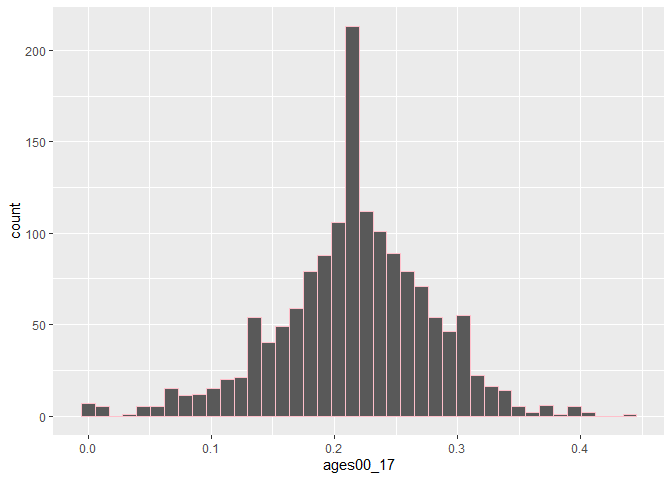

``` r
histogram1(ages18_34)
```

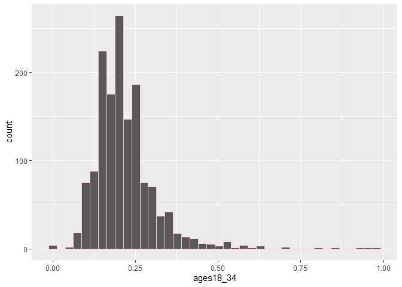

``` r
histogram1(ages35_64)
```

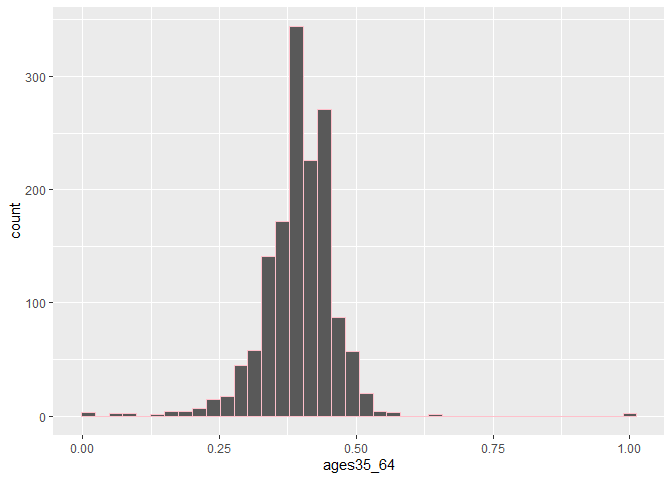

``` r
histogram1(poverty)
```

    Warning: Removed 4 rows containing non-finite outside the scale range
    (`stat_bin()`).

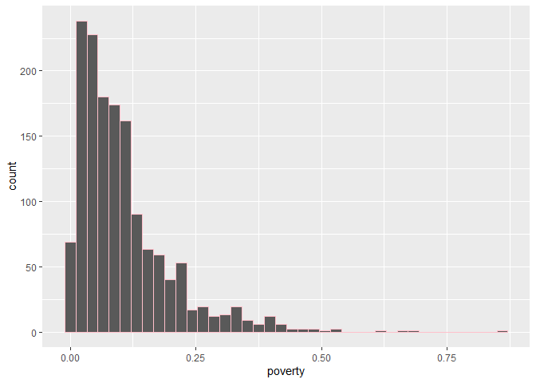

``` r
histogram2(less_than_high_school)
```


``` r
histogram2(grad_degree)
```

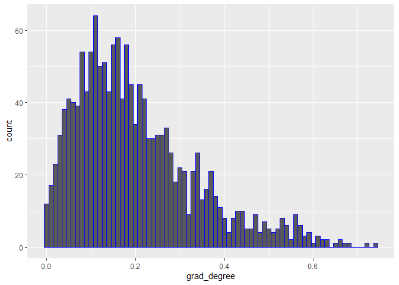

Across the six histograms, the age variables show different
distributions. `ages00_17` is relatively centered with observations
spread on both sides, while `ages18_34` is more right-skewed.
`ages35_64` is more tightly concentrated around its central values.

`poverty` is strongly right-skewed, with most observations at lower
poverty rates and fewer observations extending into much higher rates.

`less_than_high_school` and `grad_degree` are also right-skewed, with
most observations concentrated at lower rates and a smaller number of
observations reaching much higher values.

Overall, poverty, `less_than_high_school`, and `grad_degree` show the
clearest right-skewed distributions, while the age variables are
generally more concentrated around their central values.

## Unusual values

The `less_than_high_school` variable had a heavy right skew, so the most
extreme values were filtered out. Removing these extreme values made it
easier to see how most observations were distributed and showed that the
majority of areas had relatively low rates of people with less than a
high school education. The extreme values had stretched the original
histogram and made the distribution of the majority of observations
harder to see.

``` r
histogram2(less_than_high_school)
```

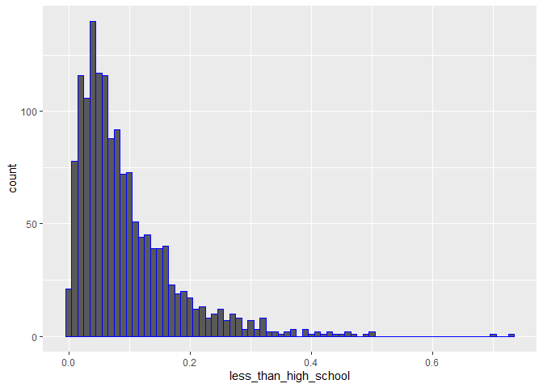

``` r
justviz::acs |>
  dplyr::filter(less_than_high_school < .5) |>
  ggplot(aes(x = less_than_high_school)) +
  geom_histogram(color = "white", binwidth = .01)
```

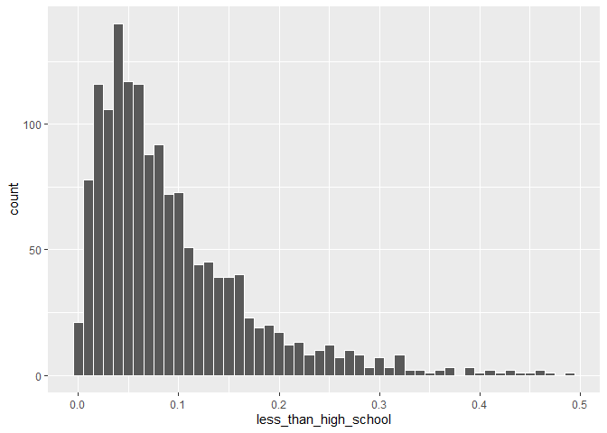

``` r
#The white trim was added to make it easier to read. I used Pink and Blue before as i wnated to seperate the types of data The age ranges and poverty are pink while education level is blue. 
```

## Covariation

I was unclear on what this section was asking me to do, specifically how
the boxplots should be used to compare a numeric variable across
counties and what patterns I should be looking for compared with the
statewide tract data.

``` r
# grab a sequential color palette
seq_pal <- RColorBrewer::brewer.pal(n = 9, name = "PuBuGn")

race <- justviz::acs |>
  dplyr::filter(
    name %in%
      c(
        "United States",
        "Maryland",
        "Baltimore city",
        "Baltimore County",
        "Anne Arundel County",
        "Howard County"
      )
  ) |>
  dplyr::select(
    level,
    name,
    white,
    black,
    latino,
    asian,
    other_race,
  )

race
```

    # A tibble: 6 × 7
      level  name                white black latino asian other_race
      <fct>  <chr>               <dbl> <dbl>  <dbl> <dbl>      <dbl>
    1 us     United States        0.57  0.12   0.19  0.06       0.05
    2 state  Maryland             0.47  0.29   0.12  0.07       0.05
    3 county Anne Arundel County  0.62  0.18   0.1   0.04       0.06
    4 county Baltimore County     0.51  0.3    0.08  0.06       0.05
    5 county Baltimore city       0.26  0.59   0.08  0.03       0.05
    6 county Howard County        0.46  0.2    0.09  0.19       0.07

``` r
race_tidy <- race |>
  tidyr::pivot_longer(
    cols = c(
      white,
      black,
      latino,
      asian,
      other_race,
    ),
    names_to = "race",
    values_to = "share"
  )

race_tidy
```

    # A tibble: 30 × 4
       level name          race       share
       <fct> <chr>         <chr>      <dbl>
     1 us    United States white       0.57
     2 us    United States black       0.12
     3 us    United States latino      0.19
     4 us    United States asian       0.06
     5 us    United States other_race  0.05
     6 state Maryland      white       0.47
     7 state Maryland      black       0.29
     8 state Maryland      latino      0.12
     9 state Maryland      asian       0.07
    10 state Maryland      other_race  0.05
    # ℹ 20 more rows

``` r
race_tidy |>
  ggplot(aes(x = share, y = name, fill = race)) +
  geom_col(width = 0.8, position = position_fill()) +
  scale_fill_manual(values = seq_pal)
```

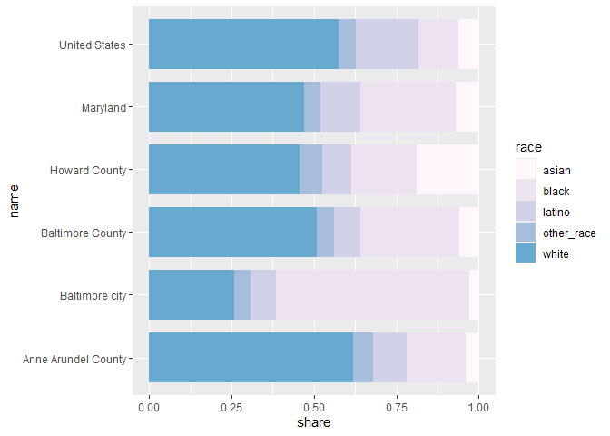

``` r
race_tidy |>
  dplyr::mutate(name = factor(name) |> forcats::fct_rev()) |>
  ggplot(aes(x = share, y = name, fill = race)) +
  geom_col(width = 0.8, position = position_fill()) +
  scale_fill_manual(values = seq_pal)
```

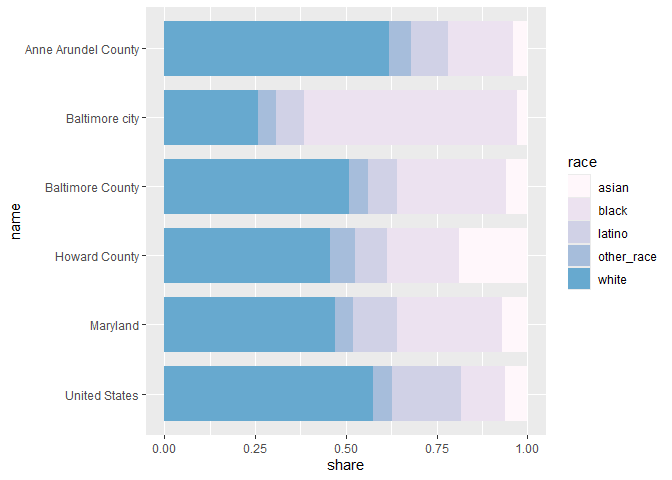

``` r
race_tidy |>
  dplyr::mutate(level = forcats::as_factor(level)) |>
  dplyr::arrange(level, name) |>
  dplyr::mutate(name = forcats::as_factor(name) |> forcats::fct_rev()) |>
  dplyr::mutate(
    race = forcats::as_factor(race) |>
      forcats::fct_relabel(snakecase::to_sentence_case) |>
      forcats::fct_recode(
        "White" = "White",
        "Black" = "Black",
        "Latino" = "Latino",
        "Asian" = "Asian",
        "Other race" = "Other race"
      )
  ) |>
  ggplot(aes(x = share, y = name, fill = race)) +
  geom_col(width = 0.8, position = position_fill(reverse = TRUE)) +
  scale_fill_manual(values = seq_pal)
```

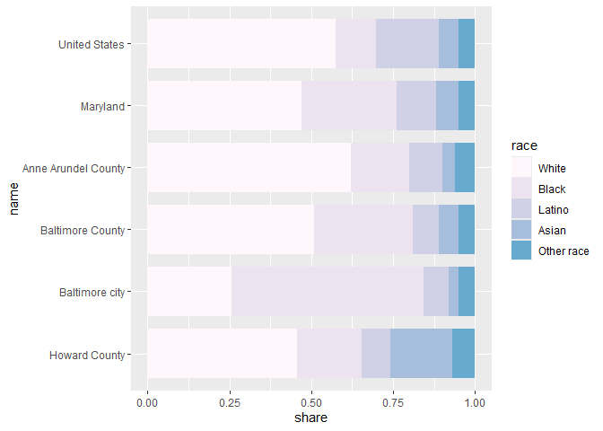

``` r
ggplot(race_tidy, aes(x = race, y = share, fill = race)) +
  geom_boxplot() +
  scale_y_continuous(labels = scales::percent) +
  scale_x_discrete(
    labels = c(
      "white" = "White",
      "black" = "Black",
      "latino" = "Latino",
      "asian" = "Asian",
      "other_race" = "Other Races"
    )
  ) +
  scale_fill_discrete(
    name = "Demographic",
    labels = c(
      "white" = "White",
      "black" = "Black",
      "latino" = "Latino",
      "asian" = "Asian",
      "other_race" = "Other Races"
    )
  ) +
  labs(
    x = "Demographic",
    y = "Rate"
  )
```

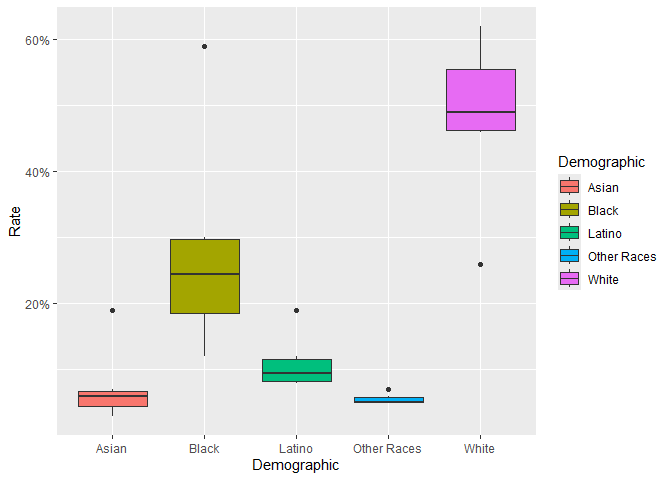

*Pick a variable you want to investigate; pretend you’re going to build
a model to predict this variable (dependent variable). Choose another
variable that you think could be a feature in your model (independent
variable), and make a scatterplot with your dependent variable on the
y-axis and your independent variable on the x-axis. If it’s too dense to
read easily, try different strategies to reduce overplotting. Repeat
this with 2 more independent variables.*

``` r
scatter_example <- justviz::acs |>
  dplyr::filter(level == "tract") |>
  dplyr::select(
    county,
    name,
    homeownership,
    median_hh_income,
    total_hh
  )
```

``` r
ggplot(scatter_example, aes(x = median_hh_income, y = homeownership)) +
  geom_point()
```

    Warning: Removed 8 rows containing missing values or values outside the scale range
    (`geom_point()`).

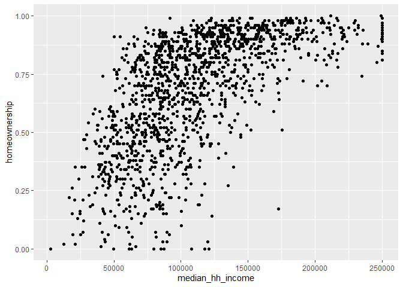

``` r
ggplot(scatter_example, aes(x = homeownership, y = total_hh)) +
  geom_point()
```

    Warning: Removed 4 rows containing missing values or values outside the scale range
    (`geom_point()`).

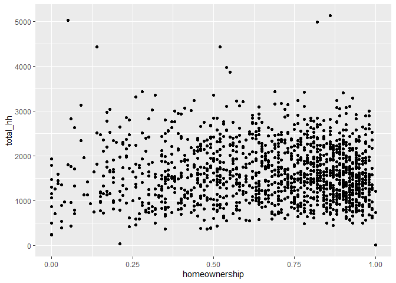

*Now pick one of those independent variables that you think could
potentially be used in a linear regression model. On your scatterplot,
add a regression line with `geom_smooth(method = lm)` (see [the
docs](https://ggplot2.tidyverse.org/reference/geom_smooth.html))*

``` r
scatter_example |>
  dplyr::filter(county == "Baltimore city") |>
  ggplot(aes(x = median_hh_income, y = homeownership)) +
  geom_point(alpha = 0.45, size = 2) +
  geom_smooth(method = lm) +
  scale_x_continuous(labels = scales::label_dollar()) +
  scale_y_continuous(labels = scales::percent) +
  labs(
    x = "
    Median Household Income",
    y = "Homeownership Rate"
  ) +
  theme_classic()
```

    `geom_smooth()` using formula = 'y ~ x'

    Warning: Removed 3 rows containing non-finite outside the scale range
    (`stat_smooth()`).

    Warning: Removed 3 rows containing missing values or values outside the scale range
    (`geom_point()`).

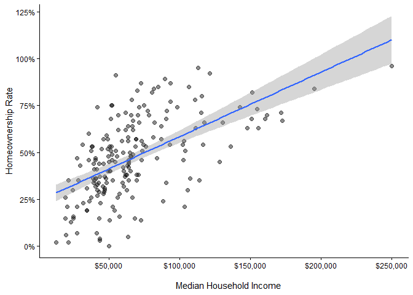

The regression line shows a positive relation between median household
incomes and homeownership rate within Baltimore City census tracts. As
the median household income increases the homeownership also rises,
though the spread of observations opens “what other factors can
contribute to the variation”.
