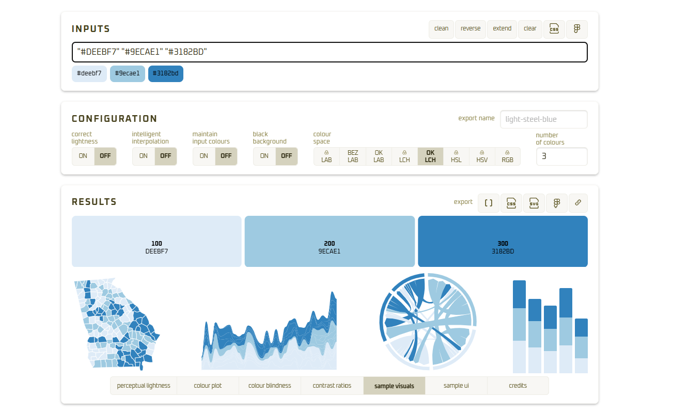

## Arts & crafts

For the first section of this lab, you'll do some arts & crafts in class with paper. For each exercise, you can take pictures of your work for your own reference, but you don't need to upload anything. Just jot down some notes here. It's more for you to have a tactile experience of working with color.

Do these in any order; we have limited sets of materials so we'll rotate.

### Sorting by hue

There are 3 sets of colors to sort by hue: one of blues, one of pastel colors in small pieces, and one of the same pastel colors in larger pieces. For each of these, lay the papers out touching side by side in a random order. Then arrange them by hue (named color, e.g. yellow, yellow-green, teal), swapping them in pairs. For example, if you're alphabetizing this set of letters:

`B D A F E C`

Your first step could be swapping B & A to get A into the first position:

`A D B F E C`

Then swap D & B to get B into second:

`A B D F E C`

and so on.

Try each set on at least 2 backgrounds. Take note of what difficulties you have, how you see colors shift depending on their neighbors, and which background is easiest.

> I found the colors easier to sort on black than on white. Against the black background, the differences between neighboring hues stood out more clearly. On white, some of the lighter colors seemed to blend into the background, which made their order harder to judge. I also noticed that a color could appear to shift slightly depending on which pieces touched it.
>
> so for the weight, using a scale from −1 (dark), 0(mid) to +1 (light). A light piece on black (+1, −1) has strong contrast and stands out, while a light piece on white (+1, +1) has less contrast. A darker piece on white (−1, +1) stands out again. This helped me understand why the background changed how easily I could distinguish and sort the colors. The blue was a good case as it fit well on both the white and black background. Since there were a little more lighter blues though id keep the darker background.
>
> For the pastels it was also nice to see it on both backgrounds. I very much prefer a grey scale/black background especially when mapping so i think i lean that way. It worked great with these colors as they are all more vibrant and would fall on the lighter side.
>
> Its the idea that any color over a scale of 1 or -1 is to much so it needs adjusted gotta find that sweet spot.

### Qualitative colors

There are 2 types of shapes in the qualitative sets; start with the bars, not the lines. You're designing charts for a client, and these colors fit their branding palette, so you're stuck with them. You have a chart with 5 groups, so pick 5 colors.

Chart 1: Lay out the bar pieces touching side by side to simulate bar charts. If two neighboring bars are too similar, shuffle them around until they're more distinct.

> The touching bars on the backgrounds was a lot of color. On the black it was fine but on the white it was very muted..

Chart 2: Move the bars apart slightly so there's a gap in between them. Does this make any pairs of colors easier to tell apart?

> The space gave each vibrant hue some separation, so I could identify the bars more easily regardless of their order. It aided the white a little but was a huge diffrence on the black background.

Chart 3: Move the pieces around to simulate stacked bars. Again, shuffle pieces if you need to to keep them distinct. The staked bars made the colors all pop or fade. Was to much to be able to ever get data from.

> The stacked bars were much harder to read. Depending on which colors touched, some sections seemed to pop while others faded. The light blue, lime green, and pink were all to light that they didn't pair well esspecially on the white. But the rest seemed to mix well with each other.

Chart 4: Using the skinny strips in the same 5 colors you chose, simulate a line chart. Do those colors still hold up with smaller markings? No There is massive discrepancies with the background.

> Very much still on what side of the (-1:0:1) it falls on. I still like the dark background more but know for actual charts that's not always the way to go.

## Code exercises

### Picking a palette

Visit [ColorBrewer](https://colorbrewer2.org) and [Carto Colors](https://carto.com/carto-colors/). For each chart below, pick a ColorBrewer or Carto palette of an appropriate type. Then apply that palette to the chart with `scale_fill_brewer` or `rcartocolor::scale_fill_carto_d`, depending on the source (and change "fill" to "color" depending on the geom type). Each function will take the palette name as its `palette` argument.

For each chart, then decide whether the default version of the palette works well. Are colors distinct enough from each other? Did you use the right type of palette (sequential, qualitative, or diverging) for the data? If the palette has a gray color, is it used in a way that makes sense? If it doesn't have a gray color, do you think it would be good to add one?

Based on those assessments, adjust your selection of colors. Get the palette as a vector (use `RColorBrewer::brewer.pal` or `rcartocolor::carto_pal`) so you can change the order of the colors however you want. Once you have your custom version of the palette, use it with `scale_fill_manual(values = new_custom_palette)` (or `scale_color_manual`).

```{r, 00_Setup}
#| label: setup
library(ggplot2)

theme_set(theme_minimal())
locations <- c(
    "United States",
    "Maryland",
    "Baltimore city",
    "Baltimore County",
    "Anne Arundel County",
    "Howard County"
)
acs_county <- justviz::acs |>
    dplyr::filter(name %in% locations)
```

```{r, 1.1_Dodged}

# ORIGINAL EXAMPLE

#| label: dodged
cost_burden <- acs_county |>
    dplyr::select(level, name, total_cost_burden, total_severe_cost_burden) |>
    tidyr::pivot_longer(
        -level:-name,
        names_to = "group",
        values_to = "share"
    ) |>
    dplyr::mutate(
        group = stringr::str_remove(group, "^total_") |> forcats::as_factor()
    ) |>
    dplyr::mutate(name = forcats::as_factor(name))

ggplot(cost_burden, aes(x = name, y = share, fill = group)) +
    geom_col(position = position_dodge2()) +
    labs(title = "Cost burden and severe cost burden rates, 2024")
```

```{r, 1.2_Dodged}

# COLOR CHANGED

#| label: dodged
cost_burden <- acs_county |>
  dplyr::select(level, name, total_cost_burden, total_severe_cost_burden) |>
  tidyr::pivot_longer(
    -level:-name,
    names_to = "group",
    values_to = "share"
  ) |>
  dplyr::mutate(
    group = stringr::str_remove(group, "^total_") |> forcats::as_factor()
  ) |>
  dplyr::mutate(name = forcats::as_factor(name))

ggplot(cost_burden, aes(x = name, y = share, fill = group)) +
  geom_col(position = position_dodge2(), color = "black", linewidth = 0.2) +
  labs(title = "Cost burden and severe cost burden rates, 2024") + 
  scale_fill_brewer(palette = "Blues")
```

## 01_Dodge

The dodge section looks way better with the color changed but i think that more on the idea i just don't like the base colors. The Blue is okey but even here i think that it inst the best option as the severe cost burden is only being represented with a darker blue to show the severity a more warm color could be used.

```{r, 2.1_Stacked-1}

# ORIGINAL EXAMPLE

#| label: stacked-1
age <- acs_county |>
    dplyr::select(level, name, ages00_17, ages18_34, ages35_64, ages65plus) |>
    tidyr::pivot_longer(
        -level:-name,
        names_to = "group",
        values_to = "share"
    ) |>
    dplyr::mutate(dplyr::across(c(name, group), forcats::as_factor))

ggplot(age, aes(x = name, y = share, fill = group)) +
    geom_col(position = position_fill(reverse = TRUE)) +
    labs(title = "Population by age group, 2024")
```

```{r, 2.2_Stacked-1}

# CHANGED COLOR

#| label: stacked-1
age <- acs_county |>
  dplyr::select(level, name, ages00_17, ages18_34, ages35_64, ages65plus) |>
  tidyr::pivot_longer(
    -level:-name,
    names_to = "group",
    values_to = "share"
  ) |>
  dplyr::mutate(dplyr::across(c(name, group), forcats::as_factor))

ggplot(age, aes(x = name, y = share, fill = group)) +
  geom_col(position = position_fill(reverse = TRUE)) +
  labs(title = "Population by age group, 2024") + 
  rcartocolor::scale_fill_carto_d(palette = "BluGrn")
```

I like the color change a lot making it a sequential palette and having the older be darker looks great! The original is fine but the fact they are all different color make the fact that they are all trying to show age less apparent.

```{r}
#| label: stacked-2
race <- acs_county |>
    dplyr::select(level, name, white, black, latino, asian, other_race) |>
    tidyr::pivot_longer(
        -level:-name,
        names_to = "group",
        values_to = "share"
    ) |>
    dplyr::mutate(dplyr::across(c(name, group), forcats::as_factor))

ggplot(race, aes(x = name, y = share, fill = group)) +
    geom_col(position = position_fill(reverse = TRUE)) +
    labs(title = "Population by race/ethnicity, 2024")
```

```{r, 3.1_Scatter_1}

# ORIGINAL COLORS 

#| label: scatter-1
acs_tract <- justviz::acs |>
    dplyr::filter(county %in% locations) |>
    # lump counties besides Balt County into "other"
    dplyr::mutate(
        balt_county = forcats::fct_other(
            county,
            keep = "Baltimore County",
            other_level = "Nearby counties"
        )
    )

ggplot(acs_tract, aes(x = foreign_born, y = diversity_idx, color = county)) +
    geom_point(alpha = 0.7) +
    labs(title = "Diversity index vs % foreign-born by tract, 2024")
```

```{r, 3.2_Scatter_1}

# CHNAGED COLORS

#| label: scatter-1
acs_tract <- justviz::acs |>
  dplyr::filter(county %in% locations) |>
  # lump counties besides Balt County into "other"
  dplyr::mutate(
    balt_county = forcats::fct_other(
      county,
      keep = "Baltimore County",
      other_level = "Nearby counties"
    )
  )

ggplot(acs_tract, aes(x = foreign_born, y = diversity_idx, color = county)) +
  geom_point(alpha = 0.7) +
  labs(title = "Diversity index vs Foreign Born Rates by tract, 2024",
       x = "Foreign Born",
       y = "Diversity Index Rate"
       ) +
  rcartocolor::scale_color_carto_d(palette = "PinkYl")+
  scale_x_continuous(labels = scales::label_percent()) +
  scale_y_continuous(labels = scales::label_percent())+
  theme (plot.background = element_rect("gray25",color = NA),
         panel.grid = element_line(color = "grey45"),
         text = element_text(color="white"), 
         axis.text = element_text(color = "white")
  )
```

```{r}
#| label: scatter-2
ggplot(
    acs_tract,
    aes(x = foreign_born, y = diversity_idx, color = balt_county)
) +
    geom_point(alpha = 0.7) +
  geom_smooth(method = "lm", se = FALSE)+
  scale_color_manual(values = c(
    "Baltimore County" = "#48B86A",
    "Nearby counties" = "gray70"
  ))+
    labs(title = "Diversity index vs % foreign-born by tract, 2024",
         x = "Foreign Born",
         y = "Diversity Index Rate")
```

### Revising a palette

I would generally caution against editing the standard, research-based palettes, especially sequential and diverging ones from ColorBrewer or Carto. But it's still good to see how you might tweak those palettes and how they change across different color spaces.

Get a copy of a premade sequential palette with only 3 colors. Print it to see its hex codes, then copy those codes and paste them as inputs in the [Chromatta tool](https://obumbratta.com/chromatta).

\

```{r}
#| label: pal-1
# with colorbrewer
pal_to_adjust <- RColorBrewer::brewer.pal(n = 3, name = "Blues") # plug in a name here
# or with carto
# pal_to_adjust <- rcartocolor::carto_pal(n = 3, name = "") # plug in a name here
print(pal_to_adjust)
```

In Chromatta, set the number of colors to 5. Make sure correct lightness and intelligent interpolation are both switched off. Start with the LAB color space selected (first button). Then switch to HSL. What do you notice about the transitions between colors and how that changes? What about after turning on correct lightness and color interpolation?

Switching between the colors the only difference i noticed was that the first two would get slightly darker. They all were but it was specifically noticeable with the first two.

Now remove the middle color so you just have the two end points. Switch between different color spaces and settings, and check out the sample visuals panel. Once you find a 5-color palette you like, export it by clicking the JavaScript copy button (looks like `[ ]`).

`['#f3f7fc', '#a1c1e6', '#518ccf', '#2a5a8f', '#13283e']`

JavaScript uses arrays similar to vectors in R, so you'll just need to change the syntax slightly. Paste it in the next code chunk, then change it from being wrapped in brackets to being wrapped in the `c()` function, e.g. change

``` javascript
['#d1eeea', '#a1c7ca', '#74a1ac', '#4c7b90', '#2a5674']
```

to

``` r
c('#d1eeea', '#a1c7ca', '#74a1ac', '#4c7b90', '#2a5674')
```

``` r
c('#f3f7fc', '#a1c1e6', '#518ccf', '#2a5a8f', '#13283e')
```

```{r}
#| label: pal-paste
pal_chrom <- c('#f3f7fc', '#a1c1e6', '#518ccf', '#2a5a8f', '#13283e') # replace with your palette from chromatta
```

Then use that new palette with `scale_fill_manual` in the chart below.

```{r}
#| label: age-bars-redo
ggplot(age, aes(x = name, y = share, fill = group)) +
    geom_col(position = position_fill(reverse = TRUE)) +
    labs(title = "Population by age group, 2024") +
    scale_fill_manual(values = pal_chrom)
```

Compare it to your previous version of this chart (population by age). Which do you like better? What works and doesn't work with each?

I like the other better and the only reason why was because this one has the color being to light to start. That was something i did and easily could change. Very simple to go back but for now this is great! i still like that the colors get darker as the age goes up. I do think the order of the group legend needs reversed so the color sequence matches the table.
