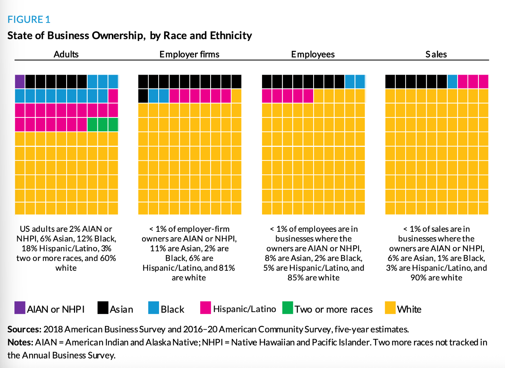
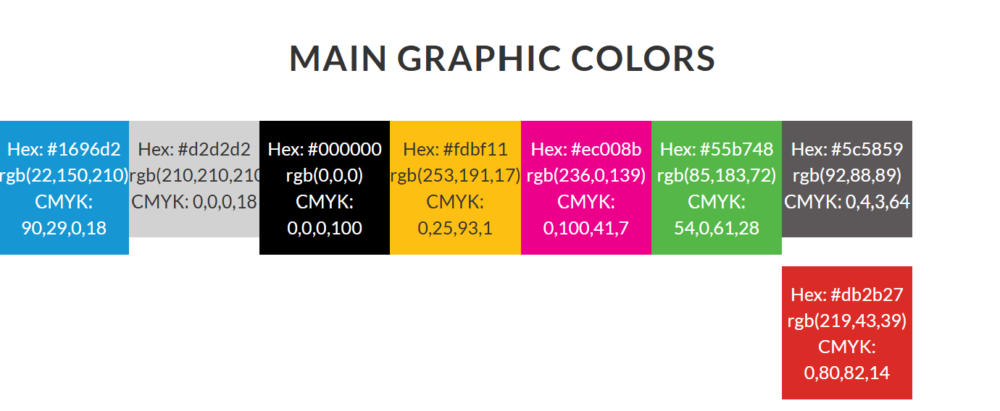

Pick 2 charts of different types from previous labs. Copy & paste the code here. Looking at the styleguide you chose last week, build color palettes and a theme that will replicate aspects of that styleguide. You don't have to adhere to everything; feel free to tweak the colors or other specifications.

#### Used - Urban Institute Data Visualization Style Guide.

```{r}
#| label: copy-old-charts_01

library(ggplot2)
library(dplyr)
library(tidyr) 

race_tidy |>
  ggplot(aes(x = share, y = name, fill = race)) +
  geom_col(width = 0.8, position = position_fill()) +
  scale_fill_manual(values = seq_pal)
```

```{r}
#| label: copy-old-charts_02

scatter_example |>
  dplyr::filter(county == "Baltimore city") |>
  ggplot(aes(x = median_hh_income, y = homeownership)) +
  geom_point(alpha = 0.45, size = 2) +
  geom_smooth(method = lm) +
  scale_x_continuous(labels = scales::label_dollar()) +
  scale_y_continuous(labels = scales::percent) +
  labs(
    x = "
    Median Household Income",
    y = "Homeownership Rate"
  ) +
  theme_classic()
```

```{r}

# these are the colors that i picked from the color guide they are in the six group catigorical section. 
race_colors <- c(
  "asian"      = "#000000",
  "black"      = "#1696D2",
  "latino"     = "#EC008B",
  "other_race" = "#55B748",
  "white"      = "#FDBF11"
)

race_labels <- c(
  "asian"      = "Asian",
  "black"      = "Black",
  "latino"     = "Latino",
  "white"      = "White",
  "other_race" = "Other Race"
)

location_labels <- c(
  "Anne Arundel County" = "Anne Arundel\nCounty",
  "Baltimore city"      = "Baltimore\nCity",
  "Baltimore County"    = "Baltimore\nCounty",
  "Howard County"       = "Howard\nCounty",
  "Maryland"            = "Maryland",
  "United States"       = "United\nStates"
)

waffle_data <- race_tidy |>
  filter(!is.na(share), share >= 0) |>
  group_by(name) |>
  filter(sum(share) > 0) |>
  mutate(
    exact = share / sum(share) * 100,
    squares = floor(exact),
    remainder = exact - squares,
    extra = 100L - sum(squares),
    squares = as.integer(
      squares +
        (rank(-remainder, ties.method = "first") <= extra)
    )
  ) |>
  uncount(squares) |>
  mutate(
    square = row_number() - 1L,
    x = square %% 10,
    y = 9 - square %/% 10
  ) |>
  ungroup()

ggplot(waffle_data, aes(x = x, y = y, fill = race)) +
  geom_tile(
    width = 1,
    height = 1,
    color = "white",
    linewidth = 0.5
  ) +
  facet_wrap(
    ~ name,
    nrow = 1,
    labeller = labeller(name = location_labels)
  ) +
  scale_fill_manual(
    values = race_colors,
    breaks = names(race_labels),
    labels = unname(race_labels),
    drop = FALSE
  ) +
  scale_x_continuous(
    expand = expansion(mult = 0)
  ) +
  scale_y_continuous(
    expand = expansion(mult = 0)
  ) +
  coord_equal() +
  labs(
    title = "Racial and Ethnic Composition",
    subtitle = "Each square represents approximately 1% of the population",
    fill = NULL,
    caption = "Source: JustViz not sure what to actually put"
  ) +
  theme_void(base_size = 13) +
  theme(
    plot.title.position = "plot",
    plot.title = element_text(
      color = "#1696D2",
      face = "bold",
      size = 20,
      hjust = 0,
      margin = margin(b = 8)
    ),
    plot.subtitle = element_text(
      hjust = 0,
      margin = margin(b = 20)
    ),
    strip.text = element_text(
      color = "black",
      face = "bold",
      size = 12,
      lineheight = 1,
      margin = margin(b = 12)
    ),
    panel.spacing = grid::unit(0.7, "cm"),
    legend.position = "bottom",
    legend.text = element_text(size = 12),
    legend.key.size = grid::unit(0.5, "cm"),
    legend.spacing.x = grid::unit(0.3, "cm"),
    plot.caption.position = "plot",
    plot.caption = element_text(
      hjust = 0,
      color = "grey40",
      margin = margin(t = 15)
    ),
    plot.margin = margin(15, 15, 15, 15)
  ) +
  guides(
    fill = guide_legend(
      nrow = 1,
      byrow = TRUE
    )
  )
```

Below is the chart i used as an example.



There is a massive change in the way the original chart looks to the new one, the main reason being that in the study guide i saw a waffle table that also addressed racial distribution.



I was also sure to use the main color scheme.

The title of the chart was also turned blue as that is something put into every chart.

The inclusion of a source was a must i just wasn't sure of what the source should be.

I wanted to make sure to get through everything bust something id like to add is also the notes section as well as replicating the labels under the graphics.

```{r}
#| label: themed-chart-2
 
scatter_example |>
  dplyr::filter(county == "Baltimore city") |>
  ggplot(aes(x = median_hh_income, y = homeownership, size = total_hh)) +
  geom_point(shape = 20, fill = "#1696D2", color = "#1696D2",
    alpha = 0.4, size = 3
  ) +
  scale_x_continuous(labels = scales::label_dollar()) +
  scale_y_continuous(labels = scales::label_percent()) +
  labs(
    title = "Homeownership and Household Income\nin Baltimore City",
    x = "Median Household Income",
    y = "Homeownership\nRate",
    caption = "Source: JustViz"
  ) +
  theme_classic(base_size = 14) +
  theme(
    panel.grid.major = element_line(color = "grey85"),
    axis.ticks = element_blank(),
    axis.title.y = element_text(angle = 0, face = "bold"),
    plot.title.position = "plot",
    axis.title.x = element_text(face = "bold", hjust = 1),
    plot.title = element_text(face = "bold", hjust = 0, color = "#1696D2"),
    plot.caption = element_text(hjust = 1)
  )
```

Below is the chart i used as an example


